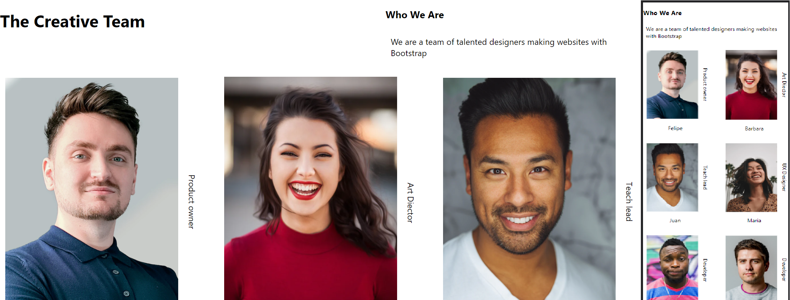

<div align="center">
      <h1> <br/>Team Page</h1></div>

<div align="center">
Solucion para el challenge de crear una Pagina de Equipo de <a href="https://devchallenges.io" target="_blank">Devchallenges.io</a>.
<br>
<a href="http://devchallenges.io" target="_blank">Devchallenges.io</a>.
</div>

## Descripción

<div align="center">
  <h3>
    <a href="https://team-pipetboy.vercel.app/">
      Demo
    </a>
    <span> | </span>
    <a href="https://devchallenges.io/challenges/hhmesazsqgKXrTkYkt0U">
      Challenge
    </a>
  </h3>
</div>




### Built With
       
     
## Características

- Puedo ver una página siguiendo el diseño dado

## Como Instalar de manera Local
Para clonar y ejecutar esta aplicación, necesitará [Git](https://git-scm.com) y [Node.js](https://nodejs.org/en/download/) (que viene con [ npm](http://npmjs.com)) instalado en su computadora. Desde su línea de comando:

```bash
# Clone this repository
$ git clone https://github.com/pipetboy2001/Team-Page

# Install dependencies
$ npm install

# Run the app
$ npm start
```
## Mi experencia en este challange
Este fue un reto mas que en tema de responsive o escribir en HTML fue el aprender uso de Typescript y Sass que seran las dos nuevas tecnologias que quiero implementar durante estos retos 